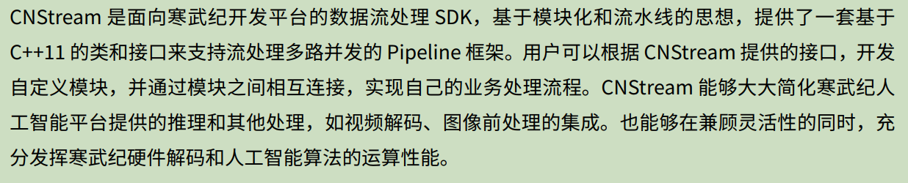
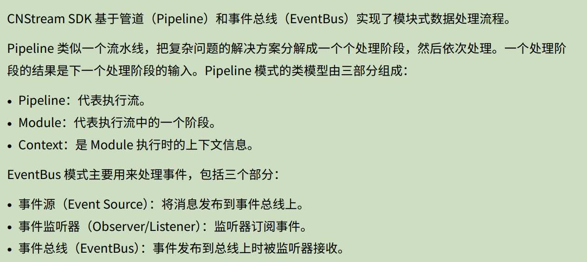
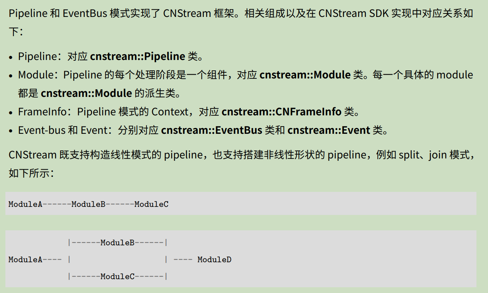

- [CNStream 用户手册](https://www.cambricon.com/docs/cnstream_new/7.1.0/user_guide/index.html)
- [CNStream 开发者手册](https://www.cambricon.com/docs/cnstream_new/7.1.0/developer_guide/index.html)

## CNStream 简介

流媒体是指通过网络实时传输音频、视频数据的同时对其进行播放显示等（无需完整下载再播放），其广泛应用于在线视频、直播、音乐服务等。

流媒体框架是用于处理、传输和播放音视频流的技术工具或软件框架，它支持实时处理和传输多媒体数据。常用的流媒体框架有GStreamer、FFmpeg等。

CNStream是带有插件的流媒体框架。

## CNStream源码学习

CNStream 源码内部主要包含框架、内置模块两部分。

### CNStream框架

echo "/sensor/id=0/type=6/mipi_dev=1/bus_id=0/sns_clk_id=0" >> files.list_sensor